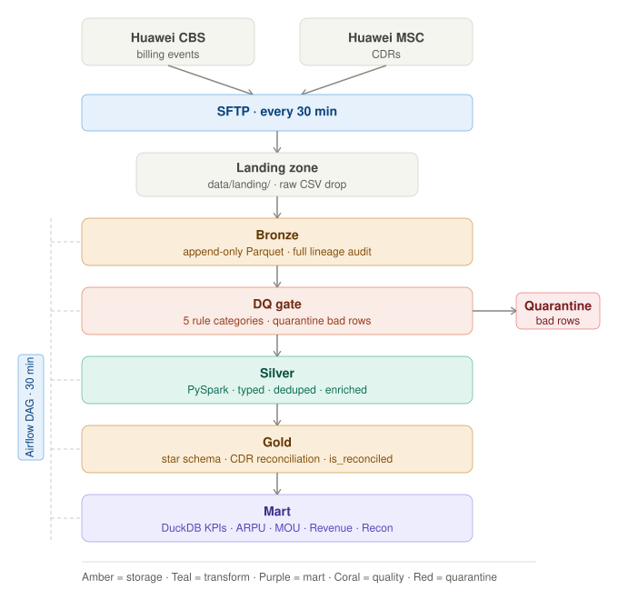
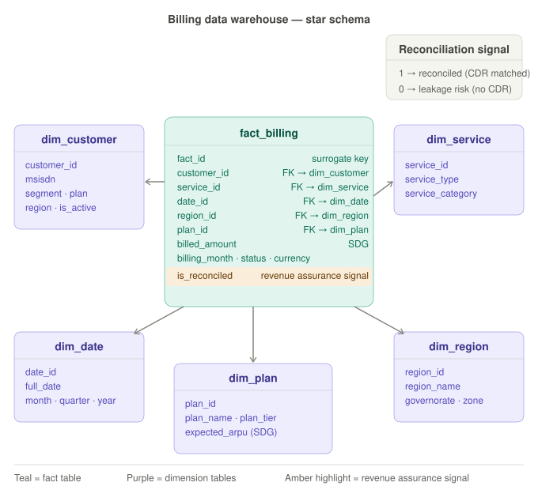

# Telecom Billing Data Warehouse

A medallion-architecture pipeline that ingests billing events from Huawei CBS and CDRs from Huawei MSC, enforces data quality at every layer, and serves financial KPIs through a star schema warehouse.

## Business Problem

Telecom operators lose revenue when billing records and network usage don't match. This platform detects those gaps by reconciling CDR events against billing records — flagging unmatched events as potential leakage.

## Objective

Build an end-to-end data warehouse that simulates real-time billing ingestion, enforces a 5-category data quality gate, models a star schema for analytical queries, and computes financial KPIs including ARPU, MOU, and CDR reconciliation rate.

## Data Sources

- **Huawei CBS** — billing events from the Convergent Billing System:
  - `customer_id`, `msisdn`, `service_type`, `billed_amount`, `billing_month`, `status`
- **Huawei MSC** — CDR records from the Mobile Switching Center:
  - `cdr_id`, `msisdn`, `service_type`, `duration_sec`, `data_mb`, `cell_id`, `event_ts`

## 🏗️ Data Architecture



The pipeline follows **Medallion Architecture** — raw data lands in Bronze as append-only Parquet, passes through a quality gate that quarantines bad rows, gets standardized and enriched in Silver via PySpark, and loads into a Gold star schema. The KPI mart is computed from Gold using DuckDB. An Airflow DAG on a 30-minute schedule orchestrates every step.

## 📐 Gold Layer — Star Schema



`fact_billing` sits at the center with foreign keys to five dimension tables. The `is_reconciled` flag is the core revenue assurance signal — a billing event with no matching CDR is flagged as potential leakage and surfaced in the reconciliation rate KPI.

## Platform Components

- **Apache Airflow** — pipeline orchestration, 30-minute DAG schedule, FileSensor trigger
- **PySpark** — Silver and Gold layer transformations at scale
- **DuckDB** — in-process KPI mart queries over Parquet (simulates Presto/Trino)
- **pandas + pyarrow** — Bronze ingestion and data quality gate
- **Snappy Parquet** — storage format across all layers (simulates HDFS)
- **pipeline_logger.py** — health monitoring: HEALTHY / WARNING / CRITICAL

## 🚀 Quick Start

```bash
# 1 — Install dependencies
pip install -r requirements.txt

# 2 — Generate synthetic telecom data
python src/phase_1_generation/generate_data.py

# 3 — Run the full pipeline
python src/phase_2_ingestion/ingest_bronze.py
python src/phase_3_quality/quality_checks.py
python src/phase_4_silver/transform_silver.py
python src/phase_5_gold/build_gold.py
python src/phase_6_mart/financial_mart.py

# 4 — Check pipeline health
python src/phase_8_monitoring/pipeline_logger.py
```
## 📂 Repository Structure

```
telecom-billing-dwh/
│
├── src/
│   ├── phase_1_generation/
│   │   ├── generate_data.py         # 3K customers · 50K billing events · 20K CDRs
│   │   └── emitter.py               # Micro-batch CSV emitter (simulates SFTP push)
│   ├── phase_2_ingestion/
│   │   └── ingest_bronze.py         # Landing CSV → Bronze Parquet + lineage metadata
│   ├── phase_3_quality/
│   │   └── quality_checks.py        # 5-category DQ gate · quarantine bad rows
│   ├── phase_4_silver/
│   │   └── transform_silver.py      # PySpark: standardize + enrich → Silver
│   ├── phase_5_gold/
│   │   └── build_gold.py            # PySpark: star schema + CDR reconciliation → Gold
│   ├── phase_6_mart/
│   │   └── financial_mart.py        # DuckDB: 5 KPIs → Mart Parquet
│   ├── phase_7_orchestration/
│   │   └── pipeline_dag.py          # Airflow DAG: FileSensor → Bronze → Quality → Silver → Gold → Mart
│   └── phase_8_monitoring/
│       └── pipeline_logger.py       # Health monitor: HEALTHY / WARNING / CRITICAL
│
├── tests/
│   ├── test_ingestion_and_quality.py
│   └── test_mart_and_monitoring.py
│
├── config/
│   └── pipeline_config.yaml         # Layer paths, telecom domain config
│
├── data/
│   ├── landing/                     # Raw CSV drop zone
│   ├── bronze/                      # Append-only raw Parquet
│   ├── silver/                      # Cleaned, enriched Parquet
│   ├── gold/                        # Star schema Parquet
│   ├── mart/                        # KPI Parquet tables
│   └── quarantine/                  # DQ-rejected rows
│
├── docs/
│   ├── architecture_diagram.svg     # Architecture diagram
│   ├── data_model.svg               # Star schema data model
│   ├── architecture.md              # Design decisions + full pipeline walkthrough
│   └── data_catalog.md              # Every table, column, type, and DQ rule
│
├── logs/
├── requirements.txt
├── .gitignore
└── README.md
```

## 📊 KPI Mart

| KPI | Description |
|---|---|
| ARPU | Average Revenue Per User by month and region |
| MOU | Minutes of Use by service type and month |
| Revenue | Total revenue by plan and governorate |
| Reconciliation Rate | % of billing events matched to a CDR — below 90% = WARNING |
| Top Customers | Top 10 revenue-generating customers per month |

## 📋 Requirements

- Python 3.8+
- Java 8+ (required for PySpark)
- See `requirements.txt` for full package list

---

## 📚 Documentation

- [Architecture & Design Decisions](docs/architecture.md)
- [Data Catalog — every table and column](docs/data_catalog.md)
